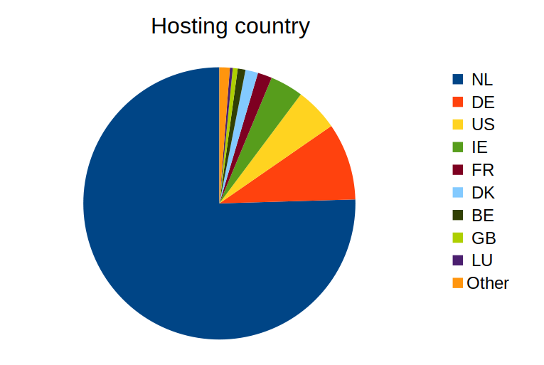
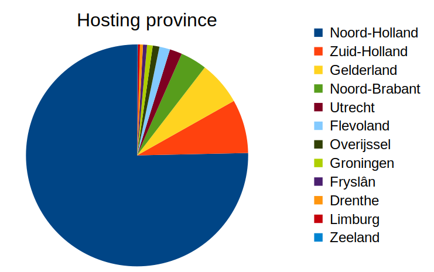

## Processing steps


### Split domain file

Split domain file in 6 smaller files (1 million records each)

```
split -l 1000000 -d 2019-05-21_all_domains_NL.txt domains-nl
```

### Run geolocation script

Process files with [this script](https://github.com/KBNLresearch/geolocatedomains/blob/master/scripts/geolocatedomains.py), running on virtual machine in SURFsara [HPC Cloud](https://doc.hpccloud.surfsara.nl/)

Total run time:

- Started Tue 1 Sep, 12:45 (approx.)
- Completed Thu 3 Sep, 18:39
- So total run time approximately 54 hours.

### QGIS 

Import resulting files in [QGIS](https://www.qgis.org/).

For each location, establish corresponding province using [Dutch Province polygons layer](https://www.nationaalgeoregister.nl/geonetwork/srv/dut/catalog.search#/metadata/e73b01f6-28c7-4bb7-a782-e877e8113e2c) (shapefile). According to description, provinces file is suitable for map scales range 1:750,000 - 1:1,000,000, which implies spatial accuracy of about 1 km.

(To classify provinces: right-click layer, *Properties*, *Symbology*, then at top change *Single symbol* to *Categorized*; in *Value* dropdown menu select *PROV_CODE*; click *Classify*).


### Spatial join with province layer

In QGIS: *Data Management Tools*, *Join Attributes by Location ...* and then export resulting layer as CSV. Repeat for each of the 6 files.

### Combine CSVs

Combine the 6 output CSV files using (head command writes header line of 1st file to output file; subsequent tail commands append all lines *except header line* from all files):

```
head -1 ~/kb/geolocation-nldomain/qgis/domains-nl00-join-prov.csv > domains-nl-join-prov.csv; tail -n +2 -q ~/kb/geolocation-nldomain/qgis/domains-nl0?-join-prov.csv >> domains-nl-join-prov.csv
```

### Install Python Pandas

```
sudo apt-get install python3-pandas
sudo python3 -m pip install markdown
sudo python3 -m pip install tabulate
```

### Analysis

Script [here](https://github.com/KBNLresearch/geolocatedomains/blob/master/scripts/analyze.py).

Compute:

- Number of active/inactive domains
- Domain count by country (absolute + relative as % of all active domains)
- Domain count by Dutch province (absolute + relative as % of all active domains hosted in NL)


## Analysis results

- Number of active domains: 4606514
- Number of inactive domains: 1256783
- Number of active domains with no country ID:26634


### Countries




| Country   |            Count |   % of all active domains |
|:----------|-----------------:|--------------------------:|
| NL        |      3.45617e+06 |                     75.03 |
| DE        | 419623           |                      9.11 |
| US        | 235962           |                      5.12 |
| IE        | 180379           |                      3.92 |
| FR        |  78023           |                      1.69 |
| DK        |  68584           |                      1.49 |
| BE        |  42333           |                      0.92 |
| GB        |  26748           |                      0.58 |
| LU        |  15569           |                      0.34 |
| CA        |   9761           |                      0.21 |
| CZ        |   8516           |                      0.18 |
| CH        |   6255           |                      0.14 |
| PL        |   4332           |                      0.09 |
| SE        |   3747           |                      0.08 |
| FI        |   3354           |                      0.07 |
| ES        |   2977           |                      0.06 |
| IT        |   2954           |                      0.06 |
| AU        |   2810           |                      0.06 |
| NO        |   2654           |                      0.06 |
| LT        |   1656           |                      0.04 |
| AT        |   1150           |                      0.02 |
| VG        |    896           |                      0.02 |
| BG        |    850           |                      0.02 |
| JP        |    581           |                      0.01 |
| RU        |    505           |                      0.01 |
| TR        |    403           |                      0.01 |
| RO        |    311           |                      0.01 |
| SG        |    290           |                      0.01 |
| HU        |    254           |                      0.01 |
| UA        |    213           |                      0    |
| CN        |    198           |                      0    |
| SK        |    157           |                      0    |
| PT        |    143           |                      0    |
| HK        |    120           |                      0    |
| PA        |    111           |                      0    |
| EE        |    100           |                      0    |
| ZA        |     92           |                      0    |
| SA        |     85           |                      0    |
| KY        |     84           |                      0    |
| MT        |     82           |                      0    |
| IS        |     76           |                      0    |
| IL        |     71           |                      0    |
| IN        |     67           |                      0    |
| BR        |     58           |                      0    |
| SI        |     53           |                      0    |
| MY        |     47           |                      0    |
| CY        |     42           |                      0    |
| NZ        |     41           |                      0    |
| LV        |     37           |                      0    |
| CW        |     34           |                      0    |
| TH        |     24           |                      0    |
| GR        |     23           |                      0    |
| HR        |     20           |                      0    |
| IR        |     20           |                      0    |
| VN        |     18           |                      0    |
| MX        |     18           |                      0    |
| IM        |     17           |                      0    |
| KR        |     16           |                      0    |
| SC        |     15           |                      0    |
| TW        |     12           |                      0    |
| BY        |     12           |                      0    |
| TZ        |     10           |                      0    |
| MD        |     10           |                      0    |
| ID        |      9           |                      0    |
| AR        |      8           |                      0    |
| AE        |      7           |                      0    |
| BQ        |      7           |                      0    |
| SM        |      7           |                      0    |
| SR        |      6           |                      0    |
| BO        |      6           |                      0    |
| RS        |      6           |                      0    |
| CO        |      5           |                      0    |
| LI        |      4           |                      0    |
| AL        |      4           |                      0    |
| BA        |      4           |                      0    |
| CL        |      3           |                      0    |
| KZ        |      3           |                      0    |
| PK        |      2           |                      0    |
| AZ        |      2           |                      0    |
| AD        |      2           |                      0    |
| CR        |      2           |                      0    |
| QA        |      1           |                      0    |
| UZ        |      1           |                      0    |
| TN        |      1           |                      0    |
| GI        |      1           |                      0    |
| KE        |      1           |                      0    |
| MA        |      1           |                      0    |
| BM        |      1           |                      0    |
| PR        |      1           |                      0    |
| AM        |      1           |                      0    |
| AW        |      1           |                      0    |
| PE        |      1           |                      0    |
| VE        |      1           |                      0    |
| GP        |      1           |                      0    |
| EG        |      1           |                      0    |
| GT        |      1           |                      0    |
| SN        |      1           |                      0    |
| TG        |      1           |                      0    |
| KW        |      1           |                      0    |
| LB        |      1           |                      0    |
| MW        |      1           |                      0    |
| PH        |      1           |                      0    |

### Provinces



| Province      |            Count |   % of all NL-hosted domains |
|:--------------|-----------------:|-----------------------------:|
| Noord-Holland |      2.60368e+06 |                        75.34 |
| Zuid-Holland  | 270357           |                         7.82 |
| Gelderland    | 221120           |                         6.4  |
| Noord-Brabant | 133056           |                         3.85 |
| Utrecht       |  62215           |                         1.8  |
| Flevoland     |  53595           |                         1.55 |
| Overijssel    |  33781           |                         0.98 |
| Groningen     |  28392           |                         0.82 |
| Fryslân       |  20184           |                         0.58 |
| Drenthe       |  14971           |                         0.43 |
| Limburg       |  11154           |                         0.32 |
| Zeeland       |   3325           |                         0.1  |

## Caveats

- Accuracy of geolocation. Value of *accuracyRadius* reported by GeoLite2 database often 50 -100 km (TODO: compute some stats on this).